```mermaid
graph TD
    subgraph T0["Tier 0 - no Delta deps"]
        awards["int.awards"]
        tn["int.transaction_normalized"]
        tfabs["int.transaction_fabs"]
        tfpds["int.transaction_fpds"]
        faba["financial_accounts_by_awards"]
        pfabs["raw.published_fabs"]
        dap["raw.detached_award_procurement"]
        subaward["raw.subaward"]
        zips["raw.zips"]
        sam["int.sam_recipient"]
        abd["rpt.account_balances_download"]
        ocpad["rpt.object_class_program_activity_download"]
    end

    tccl["int.transaction_current_cd_lookup"]
    rl["rpt.recipient_lookup"]
    ssv["rpt.summary_state_view"]
    cfs["rpt.covid_faba_spending"]
    rp["rpt.recipient_profile"]
    as["rpt.award_search (+_gold)"]
    ts["rpt.transaction_search (+_gold)"]
    ss["rpt.subaward_search"]
    td["rpt.transaction_download"]
    afd["rpt.award_financial_download"]

    tn --> tccl
    tfabs --> tccl
    tfpds --> tccl
    zips --> tccl

    tn --> rl
    tfabs --> rl
    tfpds --> rl
    sam --> rl
    pfabs --> rl
    dap --> rl

    tn --> ssv
    tfabs --> ssv
    tfpds --> ssv
    faba --> ssv

    awards --> cfs
    faba --> cfs

    rl --> rp
    tn --> rp
    tfabs --> rp
    tfpds --> rp

    tn --> as
    tfabs --> as
    tfpds --> as
    awards --> as
    faba --> as
    tccl --> as
    rl --> as
    rp --> as

    tn --> ts
    tfabs --> ts
    tfpds --> ts
    awards --> ts
    faba --> ts
    tccl --> ts
    rl --> ts
    rp --> ts

    subaward --> ss
    zips --> ss
    awards --> ss
    tn --> ss
    tfabs --> ss
    tfpds --> ss
    faba --> ss
    tccl --> ss
    rl --> ss
    rp --> ss

    as --> td
    ts --> td
    faba --> td

    as --> afd
    ts --> afd
    faba --> afd
```

# Delta Table Inventory & Dependencies

Derived from:

- `usaspending_api/etl/management/commands/create_delta_table.py` — creates the empty Delta tables. Its `TABLE_SPEC` is the union of `load_table_to_delta`, `load_query_to_delta`, and `archive_table_in_delta` specs, plus `award_id_lookup` and `transaction_id_lookup`.
- `usaspending_api/etl/management/commands/load_table_to_delta.py` — JDBC copy of a Postgres/Broker table into Delta.
- `usaspending_api/etl/management/commands/load_query_to_delta.py` — Spark SQL / DataFrame query over already-loaded Delta tables.

"Delta dependencies" below excludes `global_temp.*` views, which are JDBC views onto Postgres reference tables created by `create_ref_temp_views` (`usaspending_api/common/etl/spark.py:621`), not Delta tables.

---

## Tier 0 — No Delta dependencies

These read only from Postgres/Broker over JDBC or from `global_temp.*` reference views, so they can be created and populated in any order, in parallel.

### Populated by `load_table_to_delta`

| Delta table | DB | Source (Postgres/Broker) |
|---|---|---|
| `awards` | `int` | `rpt.vw_awards` |
| `transaction_normalized` | `int` | `int.vw_transaction_normalized` |
| `transaction_fabs` | `int` | `int.vw_transaction_fabs` |
| `transaction_fpds` | `int` | `int.vw_transaction_fpds` |
| `financial_accounts_by_awards` | `raw` | `public.financial_accounts_by_awards` |
| `published_fabs` | `raw` | `raw.source_assistance_transaction` |
| `detached_award_procurement` | `raw` | `raw.source_procurement_transaction` |
| `subaward` | `raw` | Broker `subaward` |
| `zips` | `raw` | Broker `zips` |
| `award_search_testing` | `rpt` | Postgres `award_search` |
| `recipient_lookup_testing` | `raw` | `rpt.recipient_lookup` |
| `recipient_profile_testing` | `raw` | `rpt.recipient_profile` |
| `sam_recipient_testing` | `raw` | `int.duns` |
| `transaction_search_testing` | `test` | Postgres `transaction_search` |

The `*_testing` specs are copies of Postgres views/tables used to compare current Postgres data against the Spark-transformed data.

### Populated by `load_query_to_delta`

| Delta table | DB | Notes |
|---|---|---|
| `sam_recipient` | `int` | `is_from_broker=True` — query runs against the Broker over JDBC |
| `account_balances_download` | `rpt` | Reads only `global_temp.*`: `appropriation_account_balances`, `submission_attributes`, `treasury_appropriation_account`, `cgac`, `federal_account`, `toptier_agency` |
| `object_class_program_activity_download` | `rpt` | Reads only `global_temp.*`: `financial_accounts_by_program_activity_object_class`, `treasury_appropriation_account`, `submission_attributes`, `federal_account`, `toptier_agency`, `ref_program_activity`, `object_class`, `disaster_emergency_fund_code`, `cgac` |

### Created but not populated by either command

| Delta table | DB | Populated by |
|---|---|---|
| `award_id_lookup` | `int` | `load_transactions_in_delta --etl-level award_id_lookup` |
| `transaction_id_lookup` | `int` | `load_transactions_in_delta --etl-level transaction_id_lookup` |
| `download_job` | `arc` | `archive_table_in_delta` (copies from Postgres `public.download_job`) |

---

## Tiers 1–4 — Tables with dependencies

Every table in these tiers is populated by **`load_query_to_delta`**.

### Tier 1 — depends only on Tier 0

| Delta table | DB | Delta dependencies |
|---|---|---|
| `transaction_current_cd_lookup` | `int` | `int.transaction_normalized`, `int.transaction_fpds`, `int.transaction_fabs`, `raw.zips` |
| `recipient_lookup` | `rpt` | `int.transaction_normalized`, `int.transaction_fpds`, `int.transaction_fabs`, `int.sam_recipient`, `raw.published_fabs`, `raw.detached_award_procurement` |
| `summary_state_view` | `rpt` | `int.transaction_normalized`, `int.transaction_fpds`, `int.transaction_fabs`, `int.financial_accounts_by_awards` |
| `covid_faba_spending` | `rpt` | `int.awards`, `int.financial_accounts_by_awards` |

### Tier 2

| Delta table | DB | Delta dependencies |
|---|---|---|
| `recipient_profile` | `rpt` | **`rpt.recipient_lookup`** (T1), `int.transaction_normalized`, `int.transaction_fpds`, `int.transaction_fabs` |

### Tier 3

`award_search` and `transaction_search` share the `AbstractSearch` base (`usaspending_api/search/delta_models/dataframes/abstract_search.py:25-109`), so their dependency sets are identical. The `_gold` variants reuse the same `source_query` and differ only in column list / Postgres partition spec.

| Delta table | DB | Delta dependencies |
|---|---|---|
| `award_search`, `award_search_gold` | `rpt` | `int.transaction_normalized`, `int.transaction_fpds`, `int.transaction_fabs`, `int.awards`, `int.financial_accounts_by_awards`, `int.transaction_current_cd_lookup` (T1), `rpt.recipient_lookup` (T1), `rpt.recipient_profile` (T2) |
| `transaction_search`, `transaction_search_gold` | `rpt` | *same as above* |
| `subaward_search` | `rpt` | `raw.subaward`, `raw.zips`, `int.awards`, `int.transaction_normalized`, `int.transaction_fpds`, `int.transaction_fabs`, `int.financial_accounts_by_awards`, `int.transaction_current_cd_lookup` (T1), `rpt.recipient_lookup` (T1), `rpt.recipient_profile` (T2) |

### Tier 4

| Delta table | DB | Delta dependencies |
|---|---|---|
| `transaction_download` | `rpt` | **`rpt.award_search`**, **`rpt.transaction_search`** (T3), `int.financial_accounts_by_awards` |
| `award_financial_download` | `rpt` | **`rpt.award_search`**, **`rpt.transaction_search`** (T3), `int.financial_accounts_by_awards` |

`award_financial_download.py:132-133` refers to `award_search` and `transaction_search` unqualified; they resolve to the `rpt` schema because the command runs `use rpt` from the spec's `destination_database`.

---

## Build order summary

```
Tier 0  awards, transaction_normalized, transaction_fabs, transaction_fpds,
        financial_accounts_by_awards, published_fabs, detached_award_procurement,
        subaward, zips, sam_recipient,
        account_balances_download, object_class_program_activity_download
   |
Tier 1  transaction_current_cd_lookup, recipient_lookup,
        summary_state_view, covid_faba_spending
   |
Tier 2  recipient_profile
   |
Tier 3  award_search(_gold), transaction_search(_gold), subaward_search
   |
Tier 4  transaction_download, award_financial_download
```



---

## Notes / discrepancies found while tracing

1. **`financial_accounts_by_awards` schema mismatch.** `load_table_to_delta.py:88` sets `destination_database="raw"`, but every consumer (`abstract_search`, `summary_state_view`, `covid_faba_spending`, and all three download tables) reads `int.financial_accounts_by_awards`. That implies the pipeline invokes it with `--alt-db int`; nothing in these three command files creates the `int` copy on its own.

2. **`CURATED_LIST` gaps.** The default create list (`create_delta_table.py:20-49`) includes `award_search` and `transaction_search_gold` but omits `transaction_search`, `award_search_gold`, `transaction_download`, `published_fabs`, and `detached_award_procurement` — all of which are real dependencies in the graph above. Those need `--all-tables <names>` or an explicit `--destination-table`.
